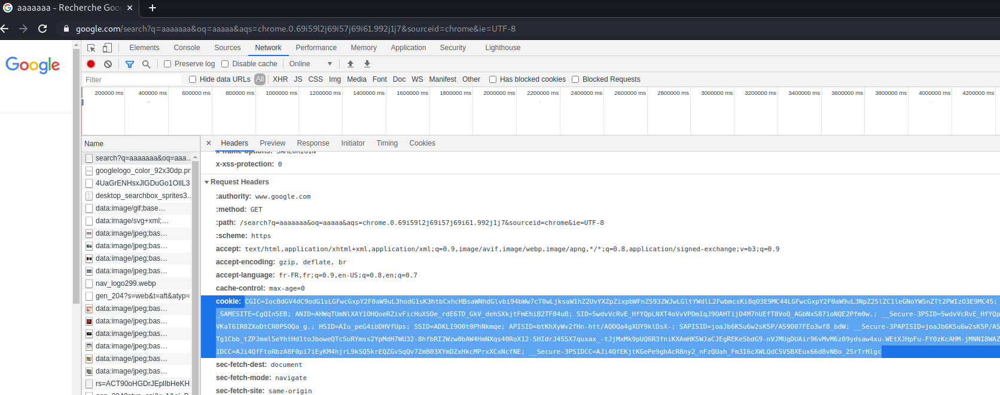

# symfony-check-vuln-google-dorks

## Installation

```bash
$ git clone https://github.com/bizibabe/symfony-check-vuln-google-dorks.git
$ python3 -m pip install -r requirements.txt
```

## How to use this script

1. Create a Google account (gmail)  
2. Connect with google-chrome 
3. Copy your cookie on google-chrome after a search  
   
4. python3 check_symfony.py --cookie "{YOUR-COOKIE}"  

```bash
usage: check_symfony.py [-h] --cookie COOKIE [--nburl NBURL] [--starturl STARTURL] [--skip SKIP]

This tool allows you to scan the configuration of Symfony developer mode using Google Dorks

required arguments:
  --cookie COOKIE      You must specify your Google Chrome cookie

optional arguments:
  --nburl NBURL        Specifies the total number of urls to scan
  --starturl STARTURL  Specifies which url to start from on Google
  --skip SKIP          Do not use the token bruteforce method : --skip true

```

## After use

Once you find vulnerable websites, you can take things a step further !  
Token + Fragment + internal url = __RCE__ 

### Best scanner for single url
(https://github.com/synacktiv/eos/)  

### RCE tool (token + fragment + internal url)
(https://github.com/ambionics/symfony-exploits)  


## Legal disclaimer:

Usage of Symphony Google Dorks Checker Tool for attacking targets without prior mutual consent is illegal. It's the end user's responsibility to obey all applicable local, state and federal laws. Developers assume no liability and are not responsible for any misuse or damage caused by this program. Only use for educational purposes.