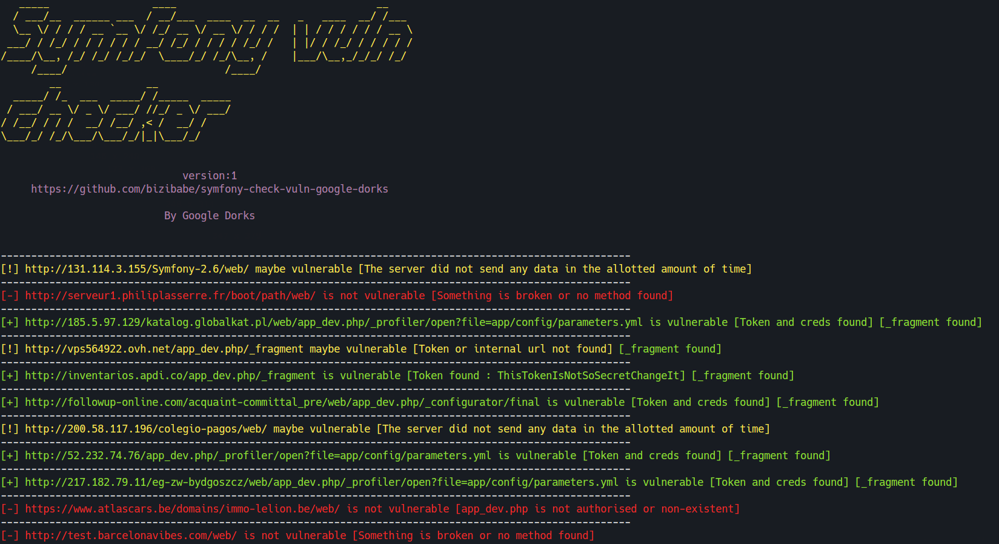

# symfony-check-vuln-google-dorks

## Legal disclaimer:

Usage of Symphony Google Dorks Checker Tool for attacking targets without prior mutual consent is illegal. It's the end user's responsibility to obey all applicable local, state and federal laws. Developers assume no liability and are not responsible for any misuse or damage caused by this program. Only use for educational purposes.

## Installation

```bash
$ git clone https://github.com/bizibabe/symfony-check-vuln-google-dorks.git
$ cd symfony-check-vuln-google-dorks
$ python3 -m pip install -r requirements.txt
```

## How to use this script

1. Create a Google Gmail account (possible to ban)
2. Connect on your new Gmail account / refresh  
3. python3 check_symfony.py --starturl 0 --nburl 20 

```bash
usage: check_symfony.py [-h] [--nburl NBURL] [--starturl STARTURL] [--jmp JMP]

This tool allows you to scan the configuration of Symfony developer mode using Google Dorks

optional arguments:
  -h, --help            show this help message and exit
  --nburl NBURL, -n NBURL
                        Specifies the total number of urls to scan
  --starturl STARTURL, -s STARTURL
                        Specifies which url to start from on Google
  --jmp JMP, -j JMP     Do not use the token bruteforce method : --jmp true

```

  

## If you have 0 result

1. Reload google chrome and check if you have been detected as a bot > pass the verrication  
__OR__
2. Delete your browsing data > reconnect to your google account 

## After use

Once you find vulnerable websites, you can take things a step further !  
Token + Fragment + internal url = __RCE__ 

### Best scanner for single url
(https://github.com/synacktiv/eos/)  

### RCE tool (token + fragment + internal url)
(https://github.com/ambionics/symfony-exploits)  

